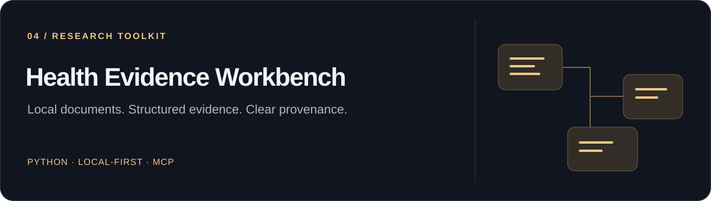

# Health Evidence Workbench

[Быстрый старт](#быстрый-старт) · [Возможности](#что-внутри) · [Приватность](#модель-приватности) · [Документация](#документация)

**Python 3.11+ · Локальная обработка документов · MCP**

Набор исследовательских и разработческих инструментов на Python для работы с
документами и научными источниками в Codex. Локальная обработка документов
отделена от поиска публичных метаданных. Проект сохраняет происхождение данных
в структурированном виде, а не выдаёт автоматическое клиническое заключение.

Мой pet-проект для собственных исследовательских задач и изучения Python,
типизированных данных и инструментов проверки. За основу идеи взял
[Claude Science](https://www.anthropic.com/news/claude-science-ai-workbench)
от Anthropic и адаптировал её под свои задачи.

> **Не медицинская рекомендация и не медицинское изделие.** Этот MVP не ставит
> диагнозы, не назначает лечение, не определяет срочность медицинской помощи,
> не подтверждает клиническую валидность и не заменяет квалифицированного врача.

## Что внутри

- Клиенты библиографических метаданных PubMed и Crossref.
- Каталог и рабочий процесс для изучения официальных рекомендаций и первичных
  источников.
- Базовые средства локального импорта документов без изменения исходников
  и синтетические тестовые данные.
- Типизированные контракты `CasePacket` и `EvidencePacket` для передачи данных
  между этапами.
- Структурная проверка связей между утверждениями и подтверждающими материалами,
  вспомогательные средства ведения журнала проверок.
- Дополнительные утилиты для лабораторных данных и амбулаторного мониторинга.
- Навыки Codex, MCP-сервер для публичной зоны и примеры карточек пациента
  и решений — только на вымышленных данных.

## Модель приватности

В публичный репозиторий намеренно **не включены реальные персональные
медицинские данные, исходные медицинские документы, локальные рабочие базы,
учётные данные и пользовательские пути**. Приватные архивы должны находиться
за пределами клона. Всё состояние, создаваемое при работе, должно оставаться
локальным и исключаться из Git. Перед коммитом проверяйте именно подготовленные
к нему файлы, а не полагайтесь только на `.gitignore`.

Проект разделён на логические зоны доверия:

| Зона | Назначение | Сеть | Исходные приватные документы |
| --- | --- | --- | --- |
| `public` | Поиск метаданных и источников | Разрешена | Запрещены |
| `private` | Явно разрешённая локальная проверка | Запрещена | Допустимы локально |
| `synthesis` | Объединение данных из пакетов без сети | Запрещена | Запрещены |
| `audit` | Структурная проверка без изменения данных | Запрещена | Запрещены |

Это дополнительные уровни защиты, а не гарантия анонимности или изоляции
пользователей. Общий процесс, задача или учётная запись операционной системы
могут переносить информацию через такие границы.

## Быстрый старт

Понадобятся Python 3.11+ и [uv](https://docs.astral.sh/uv/).

```bash
uv sync --extra dev --extra mcp --extra documents
uv run pytest
uv run health-analyzer --help
```

При необходимости скопируйте `.env.example` в локальный конфигурационный файл,
исключённый из Git. В публикуемых примерах используйте условные пути вроде
`/path/to/private-archives`. Не добавляйте в коммиты реальные пути к архивам,
идентификаторы пациентов, API-ключи или ключи псевдонимизации.

Для встроенной конфигурации MCP задайте в локальном окружении переменную
`HEALTH_ANALYZER_PROJECT_ROOT` с абсолютным путём к клону. В публичной
конфигурации намеренно оставлен шаблон: она должна быть переносимой и не
содержать персональных путей.

Обёртка публичного MCP для macOS проверяет целостность среды выполнения по
зафиксированному хешу. После проверенного изменения этой среды пересоздайте
манифест и используйте его актуальный хеш. Команды для текущей версии:

```bash
scripts/update-runtime-manifest
scripts/run-public-mcp --expected-runtime-manifest-sha256 \
  115a0ec00a0a5f4ee3ebace26e0c48a8f650c10377619dd9279b71e630f5b109
```

Обёртка намеренно использует строгие проверки и рассчитана на локальную среду
macOS. Для разработки на других платформах используйте CLI и тесты из начала
этого раздела.

## Важные ограничения

- Библиографические метаданные не заменяют полный текст исследования и сами
  по себе не подтверждают медицинские утверждения.
- Кеш источников и рекомендаций может устареть. Актуальность и применимость
  нужно проверять по самим источникам.
- Квитанции с HMAC помогают лишь локально обнаруживать изменения. Это **не**
  шифрование, цифровая подпись, аутентификация проверяющего, проверка источника
  или клиническая экспертиза.
- Проверки обезличивания основаны на эвристиках. Перед любой публичной
  передачей данных всё равно нужна проверка человеком.
- Синтетические примеры показывают движение данных, а не полноту клинического
  охвата и не медицинскую рекомендацию.

## Документация

Подробная техническая документация пока на английском:

- [Архитектура](docs/architecture.md).
- [Эксплуатация и рабочие процессы](docs/operations.md).
- [Локальная работа с PDF](docs/local-pdf-workflow.md).

## Участие в разработке и безопасность

Перед предложением изменений прочитайте [`CONTRIBUTING.md`](CONTRIBUTING.md).
Правила приватности, обращения с учётными данными и сообщения об уязвимостях
описаны в [`SECURITY.md`](SECURITY.md). Оба документа — на английском.
Не размещайте конфиденциальные материалы в публичных issues, pull requests,
тестовых данных, логах или скриншотах.

## Лицензия

В метаданных проекта пока указан статус **Proprietary**. Публичный доступ
к репозиторию не предоставляет лицензию на повторное использование. Вопросы
лицензирования нужно согласовывать с владельцем репозитория.
