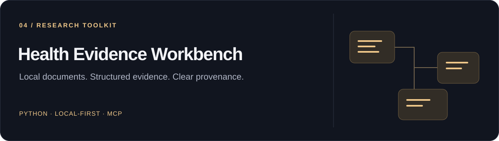

# Health Evidence Workbench

**English** | [Русский](README.ru.md)

[Quick start](#quick-start) · [What's inside](#whats-inside) · [Privacy](#privacy-model) · [Documentation](#documentation)

**Python 3.11+ · Local document processing · MCP**

A set of Python research and developer tools for working with documents and scientific sources in Codex. Local document processing is kept separate from public metadata search. The project records data provenance in a structured form instead of producing an automatic clinical conclusion.

A personal side project for my own research tasks and for learning Python, typed data and verification tooling. The idea is based on Anthropic's
[Claude Science](https://www.anthropic.com/news/claude-science-ai-workbench), adapted to my own needs.

> **Not medical advice and not a medical device.** This MVP does not diagnose,
> prescribe treatment, assess the urgency of medical care, establish clinical
> validity or replace a qualified doctor.

## What's inside

- PubMed and Crossref bibliographic metadata clients.
- A catalog and workflow for reviewing official guidelines and primary sources.
- Basic local document import that never modifies the originals, plus synthetic
  test data.
- Typed `CasePacket` and `EvidencePacket` contracts for passing data between stages.
- Structural checks of links between claims and supporting material, and helpers
  for keeping a review log.
- Extra utilities for lab data and ambulatory monitoring.
- Codex skills, an MCP server for the public zone, and example patient and decision
  cards — all on fictional data.

## Privacy model

The public repository intentionally contains **no real personal medical data, no
original medical documents, no local working databases, no credentials and no
user paths**. Private archives must live outside the clone. All state created at
runtime must stay local and excluded from Git. Before committing, check the staged
files themselves rather than relying on `.gitignore` alone.

The project is split into logical trust zones:

| Zone | Purpose | Network | Original private documents |
| --- | --- | --- | --- |
| `public` | Metadata and source search | Allowed | Forbidden |
| `private` | Explicitly allowed local review | Forbidden | Allowed locally |
| `synthesis` | Combining data from packets without network | Forbidden | Forbidden |
| `audit` | Structural checks without modifying data | Forbidden | Forbidden |

These are additional layers of protection, not a guarantee of anonymity or user
isolation. A shared process, task or operating system account can carry
information across these boundaries.

## Quick start

You need Python 3.11+ and [uv](https://docs.astral.sh/uv/).

```bash
uv sync --extra dev --extra mcp --extra documents
uv run pytest
uv run health-analyzer --help
```

If needed, copy `.env.example` to a local configuration file excluded from Git.
Use placeholder paths such as `/path/to/private-archives` in published examples.
Never commit real archive paths, patient identifiers, API keys or pseudonymization
keys.

For the bundled MCP configuration, set `HEALTH_ANALYZER_PROJECT_ROOT` in your local
environment to the absolute path of the clone. The public configuration
intentionally keeps a placeholder: it has to stay portable and free of personal
paths.

The public MCP wrapper for macOS verifies the runtime's integrity against a pinned
hash. After a reviewed change to that runtime, regenerate the manifest and use its
current hash. Commands for the current version:

```bash
scripts/update-runtime-manifest
scripts/run-public-mcp --expected-runtime-manifest-sha256 \
  d59609898bcf4e62f1bcb8606fa427a6ef7380097ec08544b18a3daf8bd1cc94
```

The wrapper deliberately uses strict checks and targets a local macOS environment.
For development on other platforms, use the CLI and tests from the start of this
section.

## Important limitations

- Bibliographic metadata does not replace the full text of a study and does not
  confirm medical claims on its own.
- The source and guideline cache can go stale. Check currency and applicability
  against the sources themselves.
- HMAC receipts only help detect changes locally. They are **not** encryption, a
  digital signature, reviewer authentication, source verification or clinical
  expertise.
- De-identification checks are heuristic. Any public sharing of data still needs
  human review.
- Synthetic examples show how data moves, not the completeness of clinical coverage,
  and they are not medical advice.

## Documentation

- [Architecture](docs/architecture.md).
- [Operations and workflows](docs/operations.md).
- [Local PDF workflow](docs/local-pdf-workflow.md).

## Contributing and security

Read [`CONTRIBUTING.md`](CONTRIBUTING.md) before proposing changes. Privacy rules,
credential handling and vulnerability reporting are described in
[`SECURITY.md`](SECURITY.md). Never put confidential material in public issues,
pull requests, test data, logs or screenshots.

## License

[MIT](LICENSE)
